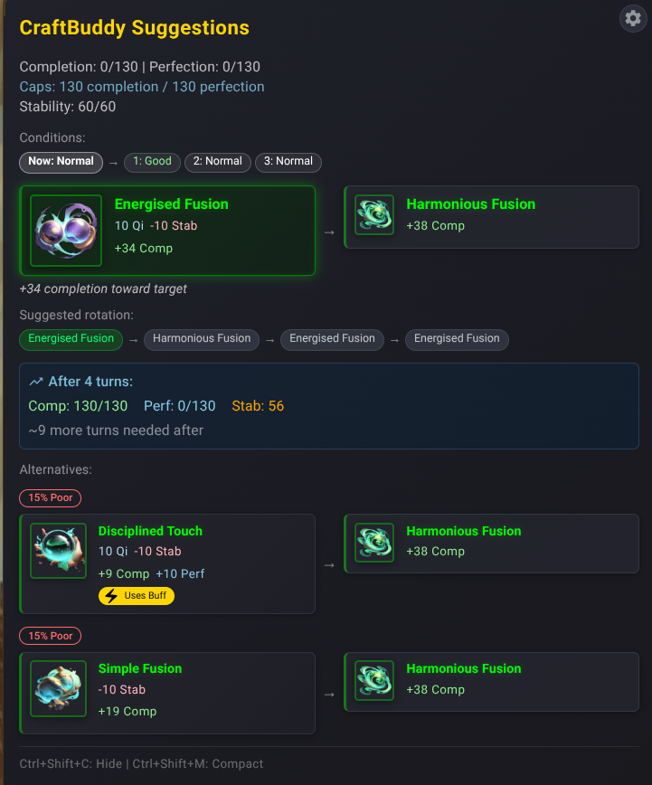
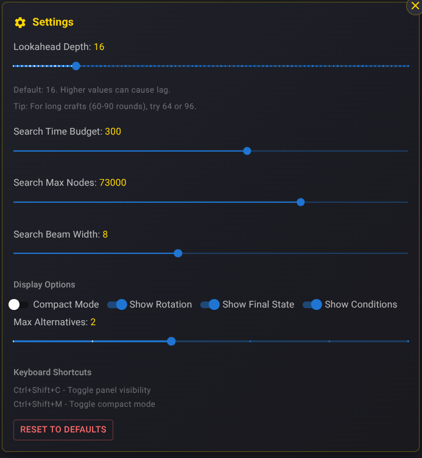

# AFNM-CraftBuddy - Crafting Optimizer Mod

A mod for **Ascend From Nine Mountains** that calculates and displays the recommended next crafting action.

## Features

- Real-time recommendation for the next action during crafting
- Expected completion/perfection/stability gain preview
- Alternative action suggestions
- Lookahead search with performance controls
- Condition forecast awareness and probabilistic branching beyond forecast queue
- Harmony-aware simulation for sublime crafts
- Buff/mastery-aware simulation
- Large-number-safe parsing and formatting for late-game values


## Installation

### Steam Workshop (Recommended)

Subscribe on the [Steam Workshop](https://steamcommunity.com/sharedfiles/filedetails/?id=3661729323).

### Manual Install

1. Download the latest release (`afnm-craftbuddy.zip`) from [Releases](https://github.com/lemon07r/AFNM-CraftBuddy/releases)
2. Create a `mods` folder in your game install directory (same folder as the game executable)
3. Copy the zip file into `mods` (do not unzip)
4. Launch the game

## Usage

During crafting (forge/alchemical/inscription/resonance), the panel shows:

- recommended next action
- expected gains
- brief reasoning
- alternatives



### Keyboard shortcuts

- `Ctrl+Shift+C`: toggle panel visibility
- `Ctrl+Shift+M`: toggle compact mode

### Settings



- `Lookahead Depth` (`1-96`, default `32`)
- `Search Time Budget` (`10-500ms`, default `200ms`)
- `Search Max Nodes` (`1,000-100,000`, default `100,000`)
- `Search Beam Width` (`3-15`, default `6`)
- display controls (rotation/final state/conditions/alternatives)

Higher depth/node/beam values improve search breadth but can increase CPU use.

## Debug helpers

### Enabling Game Dev Mode

To access browser devtools (F12) in the game, create an empty file called `devMode` (case-sensitive) in your game installation directory, next to the game executable:

```
AFNM_Linux/                              # or Windows equivalent
├── AscendFromNineMountains              # Game executable
├── devMode                              # ← Empty file, no extension
└── mods/
    └── afnm-craftbuddy.zip
```

Restart the game after creating this file.

### Debug Console Commands

Open browser devtools and use:

```javascript
window.craftBuddyDebug.getConfig();
window.craftBuddyDebug.getRecommendation();
window.craftBuddyDebug.getTargets();
window.craftBuddyDebug.getCurrentState();
window.craftBuddyDebug.getNextConditions();
window.craftBuddyDebug.getConditionEffects();
window.craftBuddyDebug.setTargets(completion, perfection, stability);
window.craftBuddyDebug.getSettings();
window.craftBuddyDebug.setLookaheadDepth(32);
window.craftBuddyDebug.togglePanel();
window.craftBuddyDebug.toggleCompact();
window.craftBuddyDebug.logGameData();
window.craftBuddyDebug.getConflicts();
window.craftBuddyDebug.checkConflicts();
```

## Build and test

```bash
bun install
bun run build
bun run test
```

Output zip: `builds/afnm-craftbuddy.zip`

## How it works

- Integration layer (`src/modContent/index.ts`) reads crafting state from game/Redux, with DOM/cache fallback paths for resilience.
- Optimizer (`src/optimizer/*`) simulates candidate actions and runs lookahead search.
- Search combines deterministic simulation with expected-value modeling for probabilistic outcomes.
- UI (`src/ui/*`) renders recommendation + alternatives.

## Technical notes

- TypeScript + React + Material UI
- Uses AFNM ModAPI hooks (including `onDeriveRecipeDifficulty`) and runtime state extraction
- Includes harmony simulation and training-mode-aware scoring behavior
- Includes docs health scripts (`bun run docs:check`)

## Data accuracy policy

CraftBuddy prefers direct game data when available and uses documented fallback logic only when specific fields are missing.

## Known limitations

- Some mechanics still rely on internal reimplementation until equivalent game APIs are exposed (scaling/overcrit/can-use-action/caps)
- Fallback extraction paths are used when complete runtime state is unavailable
- Behavior can drift if upstream game mechanics change and required APIs are not exposed yet

## Documentation

- Authoritative project docs: `docs/project/`
- Dev API request tracking: `docs/dev-requests/`
- Historical snapshots: `docs/history/`
- Curated AFNM reference subset: `docs/reference/`
- Archived full reference/deprecated snapshots: `archive/` (traceability only)
- Agent entrypoint: `docs/project/START_HERE_FOR_AGENTS.md`

## License

MIT License
