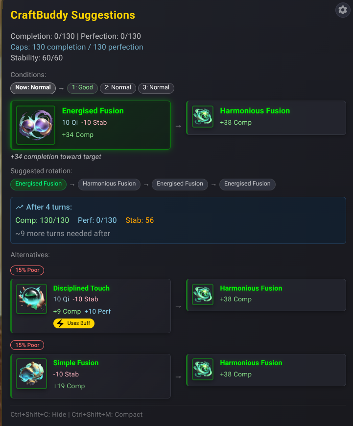
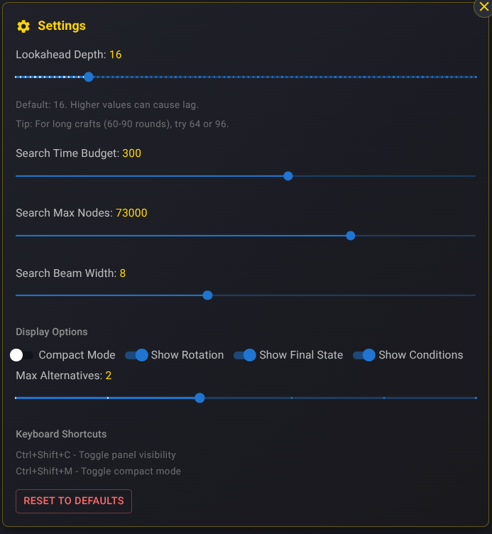

# AFNM-CraftBuddy - Crafting Optimizer Mod

A mod for **Ascend From Nine Mountains** that calculates and displays the recommended next crafting action.

## Features

- Real-time recommendation for the next action during crafting
- Expected completion/perfection/stability gain preview
- Effective qi/stability cost preview (current + follow-up), condition/buff/harmony aware
- Projected outcome tier with per-bar band progress and the bar that is blocking the next tier
- Optional ambition targets: ask for more perfection bands, or cap how far completion is worth pushing
- Alternative action suggestions
- Lookahead search with presets and manual performance controls
- Condition forecast awareness and probabilistic branching beyond forecast queue
- Harmony-aware simulation for all seven harmonies, including their complexity multipliers
- Buff, mastery, Soulflame, and toxicity-aware simulation
- Coexists with the game's crafting auto-use loadout instead of double-spending pills
- Large-number-safe parsing and formatting for late-game values
- Snapshot export for bug reports and replayable optimizer debugging

Built for game version **0.7.9**.


Now the most popular mod on steam workshop. 

## Installation

### Steam Workshop (Recommended)

Subscribe on the [Steam Workshop](https://steamcommunity.com/sharedfiles/filedetails/?id=3661729323).

### Manual Install

1. Download the latest release (`afnm-craftbuddy.zip`) from [Releases](https://github.com/lemon07r/AFNM-CraftBuddy/releases)
2. Create a `mods` folder in your game install directory (same folder as the game executable)
3. Copy the zip file into `mods` (do not unzip)
4. Launch the game

## Usage

During any craft, the panel shows:

- recommended next action
- expected gains
- the outcome tier you are on track for, each bar's band count, and which bar is holding the tier back
- brief reasoning, including when an action is setting up a gated technique
- alternatives

Crafts finish on their own once both bars are far enough along, so CraftBuddy tells you when the craft will auto-finish instead of asking you to confirm anything.



### Keyboard shortcuts

- `Ctrl+Shift+C`: toggle panel visibility
- `Ctrl+Shift+M`: toggle compact mode
- `Ctrl+Shift+Y`: export optimizer replay snapshot (clipboard first, download fallback)

### Settings



- The settings view opens as a dedicated slide-over panel face inside CraftBuddy, instead of expanding the panel footprint
- Search presets: `Instant`, `Fast` (default), `Balanced`, `High Accuracy`, `Max`
- `Lookahead Depth` (`1-96`, default `48`)
- `Search Time Budget` (`100-10,000ms`, default `2,000ms`)
- `Search Max Nodes` (`1,000-5,000,000`, default `1,000,000`)
- `Search Beam Width` (`3-20`, default `5`)
- `Goal Priority` (completion ↔ perfection, default balanced)
- `Push Extra Bands` (default on; off stops at the target tier)
- `Perfection Band Goal` (`0-8`, default `0` = Auto): aim for more perfection bands than the target tier requires
- `Completion Band Ceiling` (`0-8`, default `0` = Auto): stop scoring completion past this band
- engine selector (`Legacy` default, `Experimental` Rust/WASM assistance)
- display controls (rotation/final state/conditions/alternatives)

If you are unsure, use a preset. Presets overwrite all four search sliders together and keep them in safer ratios.

The two ambition targets are goals, not gates: `0` is Auto and reproduces the previous behaviour exactly, the perfection goal only ever raises what the search works toward, and the completion ceiling can never drop below what the target tier requires. Both sliders read `Auto` at `0` and otherwise show the band count with the approximate share of target it needs (`2 (~230%)`), because bands widen by 1.3x each. Outcome tiers, band thresholds and auto-finish are unchanged — see `docs/project/OPTIMIZER_DESIGN.md`.

Depth, time, nodes, and beam width are coupled search-budget controls: pushing one much higher than the others can waste search and sometimes reduce recommendation quality. Search stops when either the time budget or node budget is hit first, and exact results vary somewhat by craft complexity and machine speed because the time budget is wall-clock based. Manual slider changes apply when you release the slider.

## Local Workshop Publish

If the sibling uploader repo is available at `../ModUploader-AFNM`, you can publish the current build directly from this repo:

```bash
bun run workshop:upload -- --change-note "What changed"
```

That rebuilds CraftBuddy, prepares `ModUploader-AFNM`, and updates workshop item `3661729323`. Steam must be running and logged in locally.

## Debug helpers

### Enabling Game Dev Mode

To access browser devtools (F12) in the game, create an empty file called `devMode` (case-sensitive) in your game installation directory, next to the game executable:

```
AFNM_Linux/                              # or Windows equivalent
├── AscendFromNineMountains              # Game executable
├── devMode                              # ← Empty file, no extension
└── mods/
    └── afnm-craftbuddy.zip
```

Restart the game after creating this file.

### Debug Console Commands

Open browser devtools and use:

```javascript
window.craftBuddyDebug.getConfig();
window.craftBuddyDebug.getRecommendation();
window.craftBuddyDebug.getTargets();
window.craftBuddyDebug.getCurrentState();
window.craftBuddyDebug.getNextConditions();
window.craftBuddyDebug.getConditionEffects();
window.craftBuddyDebug.setTargets(completion, perfection, stability);
window.craftBuddyDebug.getSettings();
window.craftBuddyDebug.setLookaheadDepth(32);
window.craftBuddyDebug.togglePanel();
window.craftBuddyDebug.toggleCompact();
window.craftBuddyDebug.logGameData();
window.craftBuddyDebug.getDiagnostics();
window.craftBuddyDebug.getDiagnosticsSummary();
window.craftBuddyDebug.dumpOptimizerReplaySnapshot();
```

## Build and test

```bash
bun install
bun run build
bun run test
```

Output zip: `builds/afnm-craftbuddy.zip`

## How it works

- Integration layer (`src/modContent/*`) reads crafting state from game/Redux root state, with DOM/cache fallback paths for resilience.
- Optimizer (`src/optimizer/*`, behind a single `index.ts` facade) simulates candidate actions and runs lookahead search.
- `src/optimizer/outcome.ts` is the single authority for band thresholds, outcome tiers, and the auto-finish predicate.
- Search combines deterministic simulation with expected-value modeling for probabilistic outcomes, plus a guaranteed survivability floor so a craft is never bet on a recovery proc.
- A Rust/WASM engine (`crates/craftbuddy-engine/`) models the same mechanics and supplies a search prior; parity is proven by a differential corpus of 137 scenarios and 1,471 transitions.
- UI (`src/ui/*`) renders the recommendation, outcome rows, and alternatives.

## Technical notes

- TypeScript + React + Material UI, plus Rust compiled to inline WASM
- Uses AFNM ModAPI hooks, utilities, and root-state extraction, with guarded fallbacks throughout
- Includes harmony simulation and training-mode-aware behavior
- Includes docs health scripts (`bun run docs:check`)

## Data accuracy policy

CraftBuddy prefers direct game data when available and uses documented fallback logic only when specific fields are missing.

## Known limitations

- Native game APIs are used where available (overcrit, can-use-action, caps, condition transitions) with guarded fallback paths for resilience; fallback code may drift if upstream mechanics change
- Canonical post-modifier cost preview helpers are still unexposed, so cost previews use internal runtime modeling with parity checks — see `docs/dev-requests/STATUS.md`
- Fallback extraction paths are used when complete runtime state is unavailable
- Post-craft outcomes (per-harmony item effects, material returns) are not modeled: they cannot change which action is best this turn
- The panel is English-only
- Search is wall-clock budgeted, so reachable depth varies by machine; the recommendation for a fixed budget is deterministic

## Documentation

- Authoritative project docs: `docs/project/`
- Latest release notes: `docs/project/RELEASE_NOTES_6.5.0.md`
- Dev API request tracking: `docs/dev-requests/`
- Curated AFNM reference subset: `docs/reference/`
- Agent entrypoint: `docs/project/START_HERE_FOR_AGENTS.md`

## My Other Mods

- [ElderGPT Spirit Ring](https://github.com/lemon07r/ElderGPT-Spirit-Ring) — AI-powered contextual advisor overlay. Chat with any AI model inside the game. ([Steam Workshop](https://steamcommunity.com/sharedfiles/filedetails/?id=3701616500))
- [Lucky All Around](https://github.com/lemon07r/LuckyAllAround) — Configurable pity-event luck weighting for Explore events. ([Steam Workshop](https://steamcommunity.com/sharedfiles/filedetails/?id=3694065051))

[View all my mods in my AFNM mod collection](https://steamcommunity.com/sharedfiles/filedetails/?id=3704747572)

## Make Your Own Mod

Want to build your own AFNM mod? Use the [AFNM Agent Mod Template](https://github.com/lemon07r/AfnmAgentModTemplate) — a ready-to-go scaffold with ModAPI reference docs, runtime validation scripts, Workshop packaging, and built-in support for AI coding agents.

## License

MIT License
