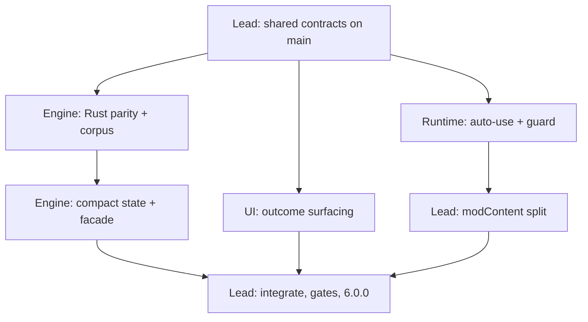

# Workstream Ownership (0.7.5 rework, final phase)

Working agreement for the parallel delivery of the final 0.7.5 phase. Parallel agent sessions share one filesystem, so **isolated worktrees are mandatory, not optional**, and file ownership is exclusive.

## Shared contracts (landed first, on `main`)

These exist so no workstream has to edit a file another one owns. They are additive and behaviour-neutral: every new field is optional, and every new default reproduces the pre-existing behaviour.

| Contract | Location | Consumed by |
| --- | --- | --- |
| `OutcomeProjection`, `OutcomeBarStatus` on `SearchResult` | `src/optimizer/search.ts` | UI |
| `SetupForHint` / `setupFor?` on `SkillRecommendation` | `src/optimizer/search.ts` | UI |
| `outcome.ts` re-exports (`deriveOutcomeBands`, `classifyOutcome`, `OutcomeTier`, `TIER_REQUIREMENTS`, …) | `src/optimizer/index.ts` | UI, Runtime |
| `NativeAutoUseStatus`, `INACTIVE_NATIVE_AUTO_USE` | `src/modContent/nativeAutoUse.ts` | Runtime |
| `AutoCraftStateVerification`, `craftStateRevision?`, `nativeAutoUse?`, `verifyRevision?()` | `src/modContent/autoCraftController.ts` | Runtime |

`outcomeProjection` is populated for every `greedySearch` / `lookaheadSearch` call by a single `withOutcomeProjection` wrapper, so the UI never recomputes a band threshold and cannot drift from the scorer.

## Worktrees

```bash
git worktree add ../cb-ws-runtime  -b feat/native-auto-use-coexistence
git worktree add ../cb-ws-engine   -b feat/rust-effect-parity
git worktree add ../cb-ws-ui       -b feat/outcome-surfacing
git worktree add ../cb-ws-docs     -b docs/075-architecture-refresh
```

Each worktree runs `bun install` once (~0.5 s, 461 packages, since the Bun cache is shared). `../cb-ws-*` sit outside the repository root, so no agent sees another's tree.

Slowest suites, for budgeting: `craftSimulation.test.ts` ~287 s, `search.test.ts` ~114 s, `modContentHarmonyState.test.ts` ~26 s. Prefer a new focused test file over extending either of the first two.

## Ownership matrix

| Workstream | Exclusively owns | Read-only |
| --- | --- | --- |
| **Runtime** — auto-use coexistence + executor guard | `src/modContent/nativeAutoUse.ts`, `autoCraftExecutor.ts`, `autoCraftController.ts`, `src/settings/autoCraft.ts`, `src/modContent/index.ts`, `src/__tests__/autoCraft*.test.ts`, `src/__tests__/nativeAutoUse.test.ts` | `src/optimizer/**` |
| **Engine** — Rust parity, corpus, perf | `crates/craftbuddy-engine/**`, `src/optimizer/nativeMcts.ts`, `src/__tests__/fixtures/differentialCorpus.ts`, `engineDifferential.test.ts`, `nativeMcts.test.ts`, `scripts/wasm/**`, `scripts/optimizer/differential-corpus*` | `src/optimizer/skills.ts`, `state.ts`, `outcome.ts` — additive changes only, lead review required |
| **UI** — outcome surfacing | `src/ui/**`, `src/utils/outcomeSummary.ts`, `src/__tests__/outcomeSummary.test.ts`, `scripts/ui/**` | `src/optimizer/index.ts`, `outcome.ts` |
| **Docs** — architecture refresh | `docs/**`, `.agents/skills/**`, `AGENTS.md`, `CLAUDE.md`, `GEMINI.md`, `README.md` | all source |
| **Lead** — contracts, resonance, split, release | `src/optimizer/index.ts`, `src/optimizer/search.ts`, `package.json`, `scripts/optimizer/benchmark-engines.ts`, `src/__tests__/search.test.ts`, `src/__tests__/outcomeProjection.test.ts`, and `src/modContent/index.ts` **after** the runtime branch merges | — |

**No worker edits `src/optimizer/index.ts`, `src/optimizer/search.ts`, or `package.json`.** Those are lead-only, which is why the shared contracts land on `main` before the branches fork.

## Ordering constraints



- Auto-use safety **merges before** the `src/modContent/index.ts` split; the split is lead-owned and sequential.
- Facade consolidation happens **only after** the expanded differential corpus passes.
- Docs merges last, because it documents what actually landed — including anything that genuinely remains limited.

## Integration protocol (lead)

1. Merge in order: runtime → engine → ui → docs, re-running the affected suite after **each** merge, not only at the end.
2. Resolve conflicts in favour of the owning workstream's intent; never hand-merge a shared contract silently.
3. Land the `modContent/index.ts` split as its own commit, with no behaviour change mixed in.
4. Run every gate on the merged tree: `docs:inventory`, `docs:check`, `typecheck`, `test`, `wasm:test`, `wasm:build`, `build`, `optimizer:bench`, `release:validate`, the expanded differential suite, and the browser harness.
5. Bump to 6.0.0 in `package.json` **and** `scripts/ui/agent-browser-harness.tsx`, write release notes, regenerate the docs inventory.
6. Commit in logically scoped conventional commits with **no co-author trailer**, then push to `origin/main`.
7. Remove the worktrees only after the merged tree is green and pushed.

## Gate state at fork time

Measured on the shared-contract commit the four branches fork from, so no workstream mistakes an inherited failure for one of its own:

| Gate | Result |
| --- | --- |
| `bun run typecheck` | pass (~35 s) |
| `bun run test` | pass — 27 suites, **666 tests** (653 inherited + 13 new), ~287 s |
| `bun run jest src/__tests__/outcomeProjection.test.ts` | pass (13 tests, ~0.4 s) |
| `bun run docs:inventory` | pass (51 files indexed) |
| `bun run docs:check-links` | pass |
| `bun run docs:check-freshness` | **failed at fork time, pre-existing** |
| `bun run docs:check-authority` | pass when run directly; the `docs:check` chain aborted before it |

`docs:check-freshness` reported three documents whose `last_verified` was `2026-07-06` against a `review_cycle_days: 14`, none of them touched by the shared-contract work:

- `docs/dev-requests/STATUS.md`
- `docs/project/MECHANICS_PARITY.md`
- `docs/project/START_HERE_FOR_AGENTS.md`

All three are **Docs-workstream property**. They were cleared on this branch by rewriting the content against the 0.7.5 tree and then bumping `last_verified` — never by bumping the date alone. All three also moved from `review_cycle_days: 14` to `30`, which matches their actual churn now that the rework has landed. The lead re-runs the full `docs:check` chain on the merged tree.

## Delivery status

Recorded from the docs workstream's vantage point, which merges last. "Delivered" means the owning branch reported the work complete with its own gates green; the lead's integration merge is what makes it true on `main`.

| Workstream | Status |
| --- | --- |
| Shared contracts | landed on `main` |
| Runtime — auto-use coexistence + dispatch-time guard | delivered on `feat/native-auto-use-coexistence` |
| Engine — Rust mechanics parity + expanded corpus | delivered on `feat/rust-effect-parity`; corpus at 129 scenarios / 1,417 transitions |
| Engine — performance | delivered: 1.90x at identical search shape. Compact state + mutate/undo **rejected with measurements**, not deferred |
| UI — outcome/band/harmony surfacing | delivered on `feat/outcome-surfacing` |
| Docs — architecture refresh | delivered on `docs/075-architecture-refresh` |
| Lead — resonance finding, `modContent/index.ts` split, 6.0.0 release | delivered on `main`: all four branches merged, the resonance finding closed as a real mechanics bug, `index.ts` split into five seams, 6.0.0 packaged |

Two things the docs deliberately describe as _decided_, not open:

- the packed numeric transposition-cache key (measured at 1.0-1.4% of the search budget, dropped)
- compact Rust state with mutate/undo (clone is 4.70% of a transition, rejected)

The `user-report-resonance-regression` finding the docs described as open was closed during integration, and not in the way anyone expected: it was a real success-weighting bug in both engines (`p * min(gain, headroom)`, not `min(p * gain, headroom)`), not a contract-materiality question. `bun run optimizer:bench` reports 98 of 98 contracts passing. See `docs/project/OPTIMIZER_ENGINE_FINDINGS.md`.

## Final integration state

All four branches are merged into `main`, each verified as an ancestor of it, and the four `../cb-ws-*` worktrees are removed. The branch refs are kept locally; nothing depends on them any more.

Gates on the merged 6.0.0 tree:

| Gate | Result |
| --- | --- |
| `bun run typecheck` | pass |
| `bun run test` | pass — 31 suites, **800 tests**, ~283 s |
| `bun run wasm:test` | pass — 58 Rust tests |
| `bun run wasm:build` | pass |
| `bun run build` | pass — `builds/afnm-craftbuddy.zip`, 5 entries, version `6.0.0` in both the manifest and the bundle |
| `bun run optimizer:bench` | pass — **98 of 98** contracts |
| `bun run optimizer:differential-corpus` | regenerates byte-identically at 129 scenarios / **1,417** transitions |
| `bun run docs:inventory` / `docs:check` | pass — 53 files, links, freshness and authority |
| `bun run release:validate` | pass |
| `ui:harness:build` + `ui:harness:serve` | pass — the panel renders the tier, band counts, binding-bar marker and `v6.0.0` in a real browser |

**Not pushed.** `git push origin main` fails on this machine for lack of credentials: no `credential.helper`, no `GH_TOKEN` / `GITHUB_TOKEN`, `gh auth status` reports the stored token invalid, and `ssh -T git@github.com` answers `Permission denied (publickey)`. Re-authenticating is interactive, so the release commits sit on local `main`. Push, tag `v6.0.0`, and the Workshop upload are the remaining human steps — in that order, per `docs/project/RELEASE_PROCESS.md`.

## When this document expires

This is a delivery-coordination record for one phase, and it has already stopped being a working agreement: the worktrees are gone and the only step left is the push. Read it as history — keep the ownership and ordering pattern, but do not treat its branch names as live or its fork-time gate numbers as current.

## Runtime authority

`docs/project/RUNTIME_EVIDENCE_075.md` is the authority for the native auto-use hook, the absence of a manual finish action, and the resonance formulas. Do not re-derive those from tooltips, patch notes, or earlier CraftBuddy notes.
